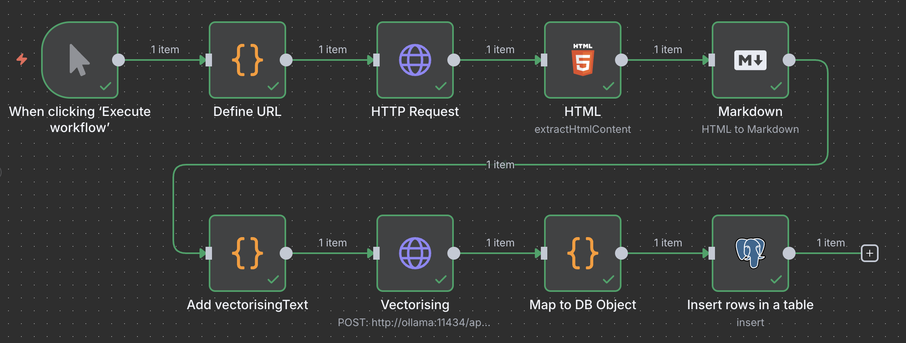

# ai-ragcrawler-prototype



What the workflow do:
1. Defines a static URL for the test
2. Get the HTML of that URL
3. Map HTML to JSON object and transform HTML of the text to Markdown
4. Define `vectorisingText` as combination of title and text
5. Use local embedding model to add the embedding vectors 
6. Combine all data to a DB object
7. Stores it in the PostgreSQL

## Installation

1. Install [Docker Desktop](https://www.docker.com/) and start it
2. Run `docker compose up -d` to pull and start docker containers
3. Run `docker exec -it ollama ollama pull embeddinggemma` to pull embedding model
4. Open adminer in your browser via `http://localhost:8080/`, use these credentials:
    - Datenbank System: PostgreSQL
    - Server: postgres
    - Benutzer: n8n
    - Passwort: n8npassword
    - Datenbank: n8n
5. Enable vector extension via:
```sql
CREATE EXTENSION IF NOT EXISTS vector;
```
6. Create `news` table via:
```sql
CREATE TABLE news (
    id SERIAL PRIMARY KEY,
    title VARCHAR(255),
    text TEXT,
    published_at TIMESTAMP,
    url VARCHAR(255) UNIQUE,
    embedding vector(768)
);
```
7. Open n8n in your browser via `http://localhost:5678/` and create account
8. Import [n8n-workflow.json](./n8n-workflow.json)
9. Run it :)
