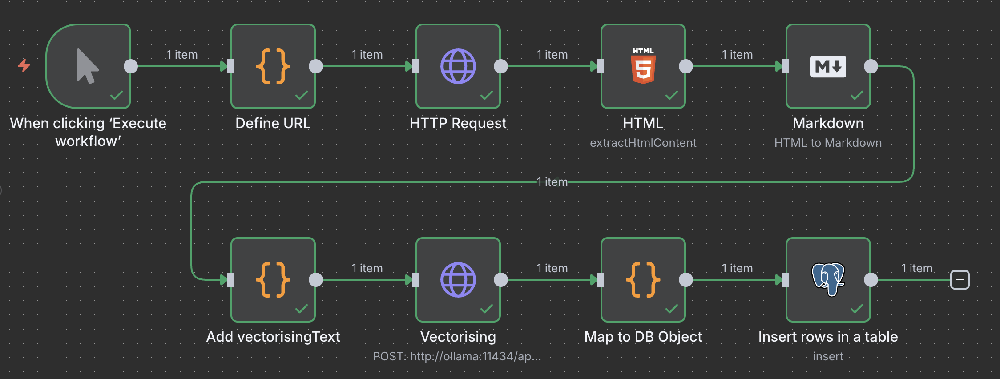

# Single Newspage

The workflow only allow to define an URL to a single newspage and process it.

What the workflow exactly do:
1. Defines a static URL of a single newspage for the test
2. Get the HTML of that URL
3. Map HTML to JSON object and transform HTML of the text to Markdown
4. Define `vectorisingText` as combination of title and text
5. Use local embedding model to add the embedding vectors 
6. Combine all data to a DB object
7. Stores it in the PostgreSQL
