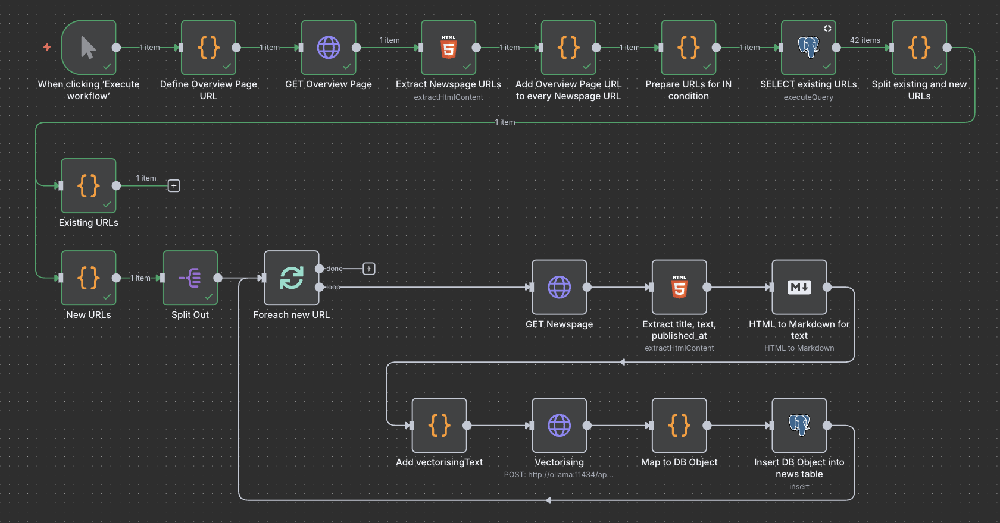

# Single Newspage

The workflow allow to define an URL to an overview page to extract and process all linked newspages.

What the workflow exactly do:
1. Defines a static URL of an overview page for the test
2. Get the HTML of that URL
3. Extract all URLs to the linked newspage
4. Select all already existing URLs from the database with that URLs
5. Split the URLs into already existing ones and the new ones
6. For each new URL of a newspage:
    1. Get the HTML of that URL
    2. Map HTML to JSON object and transform HTML of the text to Markdown
    3. Define `vectorisingText` as combination of title and text
    4. Use local embedding model to add the embedding vectors 
    5. Combine all data to a DB object
    6. Stores it in the PostgreSQL
